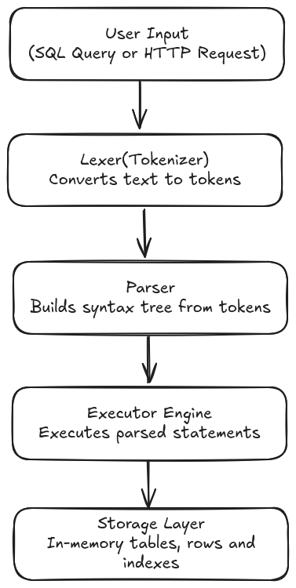
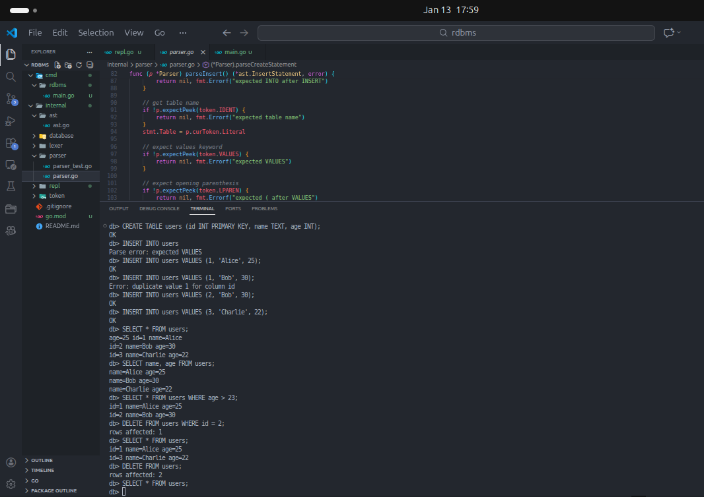

# Simple Relational Database Management System (RDBMS) in Go

A lightweight, in-memory rdbms built from scratch in Go, with SQL-like syntax, basic CRUD operations, constraints and a web app demo.

## Project Overview
This project was developed as a technical challenge to demonstrate understanding of:
- Database internals (storage, indexing, query execution)
- Lexical analysis and parsing
- System design and architecture
- Go programming best practices

**Demo:**
[Web App Demo](assets/webapp.mp4)

## Features

### Core Database Features
- **SQL-like Query Language** - Familiar syntax for db operations
- **CRUD Operations** - Create, Read, Update, Delete support
- **Schema Management** - Define tables with typed columns
- **Primary Key Constraints** - Automatic uniqueness enforcement
- **Unique Constraints** - Multiple unique columns per table
- **Indexing** - Hash-based indexes for fast lookups
- **WHERE Clauses** - Filering with `=`, `>`, `<` operators
- **Column Projection** - Select specific columns of `SELECT *`

### Supported Data Types
- `INT`  - Integer values
- `TEXT` - String values
- `BOOL` - Boolean values

### Supported Commands
```sql
-- Create table with constraints
CREATE TABLE users (
    id INT PRIMARY KEY,
    name TEXT,
    email TEXT UNIQUE
)

-- Insert data
INSERT INTO users VALUES (1, 'Alice', 'alice@example.com')

-- Query data
SELECT * FROM users
SELECT name, email FROM users WHERE id = 1

-- Update data
UPDATE users SET name = 'Bob' WHERE id = 1
UPDATE users SET name = 'Charlie', email = 'charlie@example.com' WHERE id = 2

-- Delete data
DELETE FROM users WHERE id = 1
DELETE FROM users -- delete all rows
```

### Additional Features
- **Interactive REPL** - Command-line interface for database operations
- **Web App** - TODO list demo that interacts with the rdbms via a REST API
- **Thread Safety** - Concurrent access support with mutex locks
- **Query Optimization** - Index-based lookups for WHERE clauses

## Architecture
### Systems Components


### Code Structure
```
rdbms/
├── assets/
│   └── repl.png
│   └── webapp.png             
├── cmd/
│   └── rdbms/
│       └── main.go              # Application entry point
├── internal/
│   ├── api/
│   │   ├── handler/             # HTTP request handlers
│   │   ├── routes/              # Route definitions
│   │   └── templates/           # HTML template
│   ├── app/
│   │   └── webapp.go            # Web application setup
│   ├── ast/
│   │   └── ast.go               # Abstract Syntax Tree definitions
│   ├── engine/
│   │   ├── database.go          # Core database logic
│   │   ├── executor.go          # Query execution
│   │   ├── index.go             # Indexing implementation
│   ├── lexer/
│   │   ├── lexer.go             # Tokenization
│   │── tokens/
│   │   └── token.go             # Token definitions
│   └── parser/
│   │   └── parser.go            # SQL parsing
│   └── repl/
│       └── repl.go              # Interactive command-line interface
├── go.mod
└── README.md
```

### Key Design Decisions
**1. In-Memory Storage**
- **Why:** Simplifies implementation
- **Trade-off:** Data is lost on restart
- **Production consideration:** Would add Write-Ahead Log and periodic snapshot persistence

**2. Hash-Based Indexing**
- **Why:** O(1) lookup performance for equality checks
- **Trade-off:** No range queries
- **Benefit:** Automatic indexing on `PRIMARY KEY` and `UNIQUE` columns

**3. Simplified SQL Syntax**
- **Why:** Simplified complexity
- **Omissions:** No `JOINS`, no `AND/OR` in `WHERE`, no subqueries, no `GROUP BY`, no `ORDER`.
- **Benefit:** Demonstates core concepts without too much complexity

## Getting Started

### Prerequisites
- Go 1.21 or higher
- Git

### Installation
```bash
# Clone the repository
git clone git@github.com:raskovnik/rdbms.git
cd rdbms

# download dependencies
go mod download

# build the project
go build -o rdbms cmd/rdbms/main.go
```

### Running the REPL
```bash
# Start interactive mode
./rdbms -mode=repl

# Or run with go run
go run cmd/rdbms/main.go -mode=repl
```

**Example REPL session:**


### Running the Web App
```bash
# Start web server
./rdbms -mode=webapp -port=8080

# Or with go run
go run cmd/rdbms/main.go -mode=webapp
```

Then open your browser to: `http://localhost:8080`

### API Endpoints

| Method | Endpoint      | Description          |
|--------|---------------|----------------------|
| GET    | /todos        | List all todos       |
| POST   | /todos        | Create a new todo    |
| PUT    | /todos/{id}   | Update todo status   |
| DELETE | /todos/{id}   | Delete a todo        |

**Example API Usage:**
```bash
# Create a todo
curl -X POST http://localhost:8080/todos \
    -H "Content-Type: application/json"  \
    -d  '{"task": "Learn SQL"}'

# Get all todos
curl http://localhost:8080/todos

# Update todo
curl -X PUT http://localhost:8080/todos/1 \
    -H "Content-Type: application/json" \
    -d '{"completed":1}'

# Delete todo
curl -X DELETE http://localhost:8080/todos/1
```

## Implementation Details

### Lexer (Tokenization)
The lexer converst raw SQL text into tokens:
```
Input: "SELECT * FROM users WHERE id = 1"
Tokens :[SELECT, ASTERISK, FROM, IDENT(users), WHERE, IDENT(id), ASSIGN, INT(1)]
```

**Key features:**
- Case-insensitive keywords
- String literals in single quotes
- Numeric literals
- Identifier recognition

### Parser (Syntax Analysis)
The parser builds an Abstract Syntax Tree(AST) from tokens:
```go
SelectStatement{
    Columns: [*],
    Table: "users",
    Where: &WhereClause{
        Column: "id",
        Operator: "=",
        Value: 1,
    },
}
```

**Parsing approach:**
- Recursive descent parsing
- Predictive parsing (lookahead of 1 token)
- Clear error messages with context

### Executor (Query Execution)
The executor processes AST nodes and manipulates data:

```go
// IF WHERE clause targets an indexed column, use index lookup
if index, indexed := table.Indexes[stmt.Where.Column]; indexed {
    // use index lookup
    rowIndices := index.Lookup(stmt.Where.Value) // O(1)

} else {
// full table scan
}
```

### Index Structure
```go
type Index struct {
	ColumnName string
	Data       map[interface{}][]int // value -> row indices
}
```

**Example:**
```
users table:
    Row 0 : {id: 1, name: "Alice"}
    Row 1 : {id: 2, name: "Bob"}
    Row 2 : {id: 3, name: "Charlie"}

Index on 'id':
    1 -> [0]
    2 -> [1]
    3 -> [2]
```

Lookup `id = 2` -> Index returns `[1]` -> Access row 1 directly (O(1))

## Learning Resources
This project was built using knowledge from:

### Books
- **[Writing An Interpreter in Go by Thorsten Ball](https://interpreterbook.com/)**

### Documentation
- **Go Official Documentation**
- **Chi Router Documentation**

### Tutorials
- **[Parsing Explained - Computerphile](https://youtu.be/bxpc9Pp5pZM)**
- **[Database Indexing for Dumb Developers](https://youtu.be/lYh6LrSIDvY)**
- **[SQL indexing best practices | How to make your database FASTER!](https://youtu.be/BIlFTFrEFOI)**
- **[6 SQL Joins you MUST know! (Animated + Practice)](https://youtu.be/Yh4CrPHVBdE)**
- **[The Markdown Guide](https://www.markdownguide.org/basic-syntax/)**

## Known Limitations

### Not Implemented (By Design)
- **JOIN operations** - Parsed but not executed
- **Complex WHERE clauses** - NO `AND/OR` operators
- **Persistence** - Data is lost on restart
    - Future: Serialize everything into a file and reload it on start up, Write-Ahead Log, Snapshots and recovery.
- **Aggregate functions** - No `COUNT`, `SUM`, `AVG` etc
- **ORDER BY / LIMIT** - No result ordering or pagination
